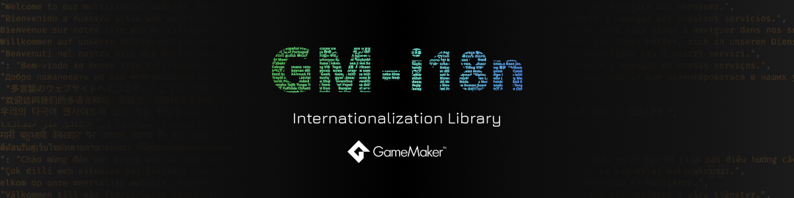

**A powerful, open-source internationalization (i18n) library for GameMaker 2.3+**

---

## Features

- Comprehensive multi-language support with JSON-based locale files.
- Automatic locale file loading with configurable timing.
- Flexible translation system:
	- Static translations for fixed text.
	- Dynamic translations with variable interpolation.
	- Real-time translation updates.
- Advanced pluralization with customizable rules.
- Dictionary system for managing related translations.
- Direct message drawing with customizable presets.
- Asset localization for sprites, sounds, and other assets.
- Debug mode with detailed logging and validation.
- Optimized performance.

---

## Supported GameMaker Versions

Please check the [tested versions page](https://github.com/undervolta/GM-I18n/issues/2) for the list of tested versions.

---

## Documentation

You can find the documentation [here](https://gm-i18n.lefinitas.com/). Visit the documentation repository [here](https://github.com/undervolta/gm-i18n-docs).

---

## Questions & Feature Requests

Feel free to start a [discussion](https://github.com/undervolta/GM-I18n/discussions) if you have any questions or suggestions. Also feel free to open an [issue](https://github.com/undervolta/GM-I18n/issues) if you want to report a bug or request a feature. 

I'll try my best to answer your questions and implement your feature requests. But, please don't expect too much, I'm not that professional and I'm doing this in my free time.

---

<!-- ## To-Do List

- [ ] Add more tests

--- -->

## Changelog

See the [changelog](https://github.com/undervolta/GM-I18n/blob/main/CHANGELOG.md) for more information about the changes in each version.

---

## Contributing

How to contribute to this project:

1. Fork the [GM-I18n repository](https://github.com/undervolta/GM-I18n).
2. Clone the forked repository to your local machine.
3. Make and test your changes.
4. Commit your changes and push it to your forked repository.
5. Open a pull request to the main repository.

Please make sure to follow the code style of the project. 

For major changes, please open an issue first to discuss what you would like to change. 

---

<!-- ## Acknowledgements

I want to thank the following people for their contributions to this project:

- [Abc](https://github.com/Abc) for his help in testing and providing feedback.

--- -->

## Support

If you like this project, please consider supporting me on [Ko-fi](https://ko-fi.com/undervolta) or [Trakteer](https://trakteer.id/undervolta). Don't forget to leave a star! Your support is greatly appreciated!

---

## License

GM-I18n is **free** and **open-source**, and it's distributed under the [MIT License](https://github.com/undervolta/GM-I18n/blob/main/LICENSE).
